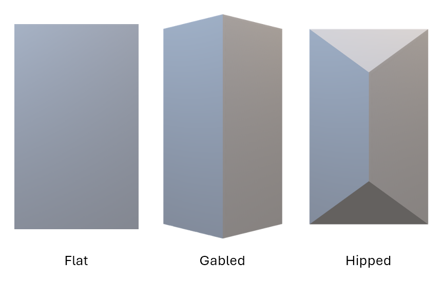
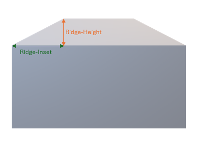
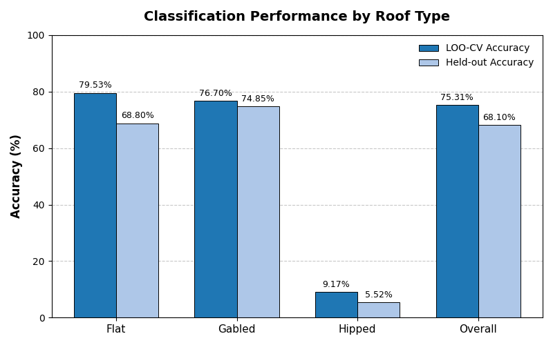
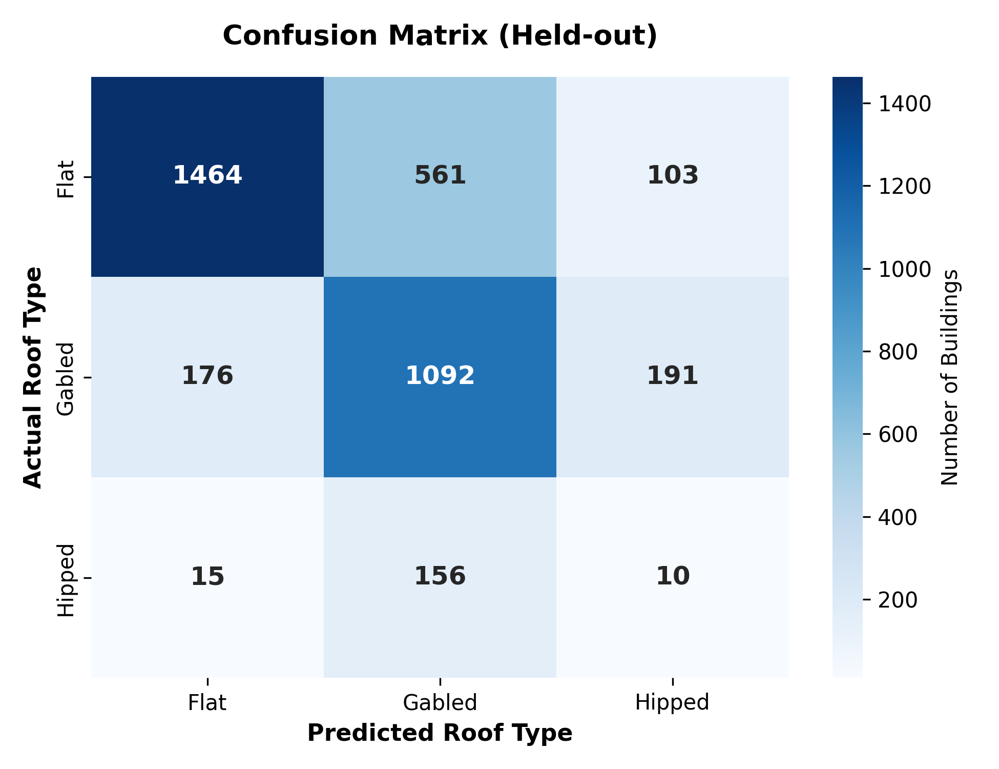
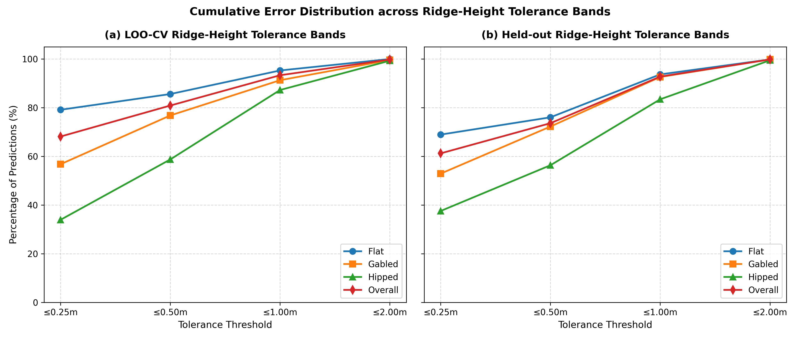
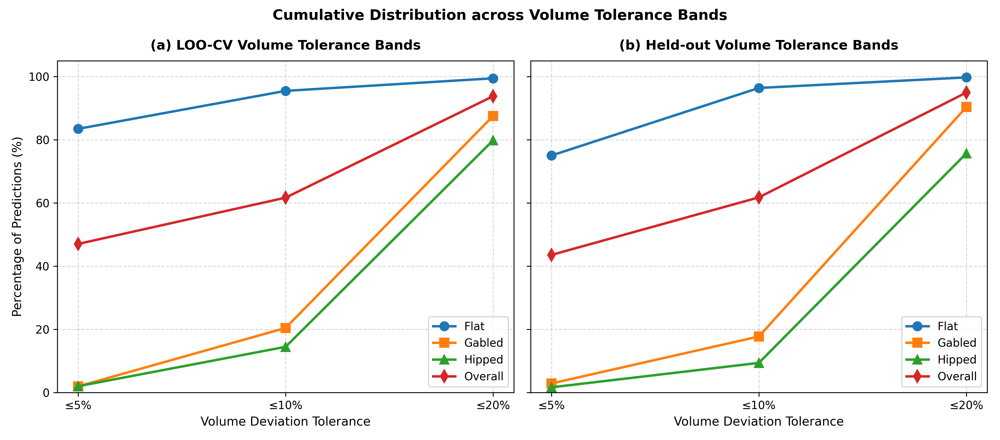
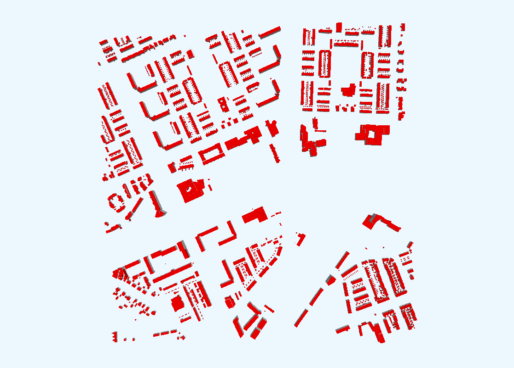
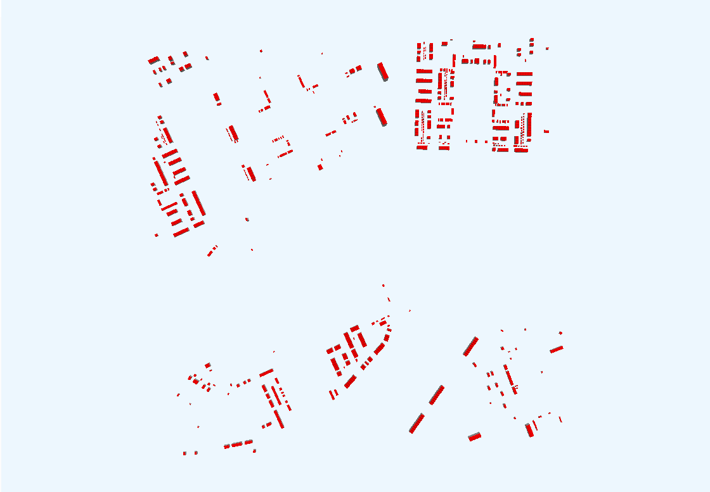
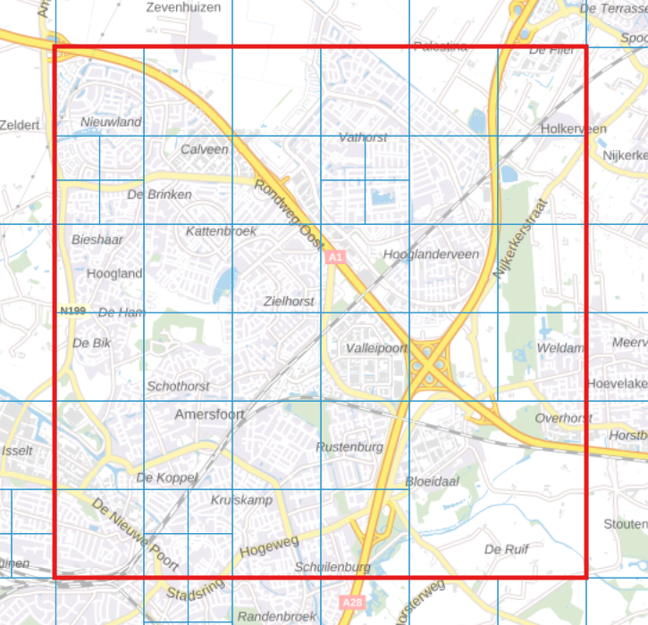

# LOD1.3 → LOD2.2: Parametric Roof Reconstruction without Point Clouds

This repository contains the pipeline developed for the Bachelor's thesis
**"Automatic Refinement of 3D Building Models from LOD1.3 to LOD2.2:
Parametric Roof Reconstruction with Machine Learning, without Point
Clouds"** (Chandra Venkata Sai Sarika, Murli Mohan Sarika — Blekinge
Institute of Technology, June 2026). Full text: [DiVA
portal](http://www.diva-portal.org/smash/record.jsf?pid=diva2:2084398).

The pipeline upgrades LOD1.3 building models (simple extruded blocks) to
LOD2.2 (explicit roof geometry — ridges, eaves, slopes) **without LiDAR,
photogrammetry, or any other sensor data**. It relies entirely on the
geometric information already present in the LOD1.3 model: footprint shape
and building height.

## Contents

- [Why](#why)
- [Method](#method)
- [Results](#results)
- [Limitations \& scope](#limitations--scope)
- [Repository structure](#repository-structure)
- [Installation](#installation)
- [Data](#data)
- [Usage](#usage)
- [Reproducibility](#reproducibility)
- [Future work](#future-work)
- [Citation](#citation)
- [License](#license)
- [Acknowledgments](#acknowledgments)

## Why

Three-dimensional city models support solar-potential analysis, flood
simulation, and energy-efficiency modelling — but only if the model
captures roof geometry, not just building footprint and height. Most
national datasets (including many outside the Netherlands) are stuck at
LOD1.x because producing LOD2.2 at scale normally means processing dense
LiDAR point clouds: expensive, and unavailable to many municipalities and
countries.

This project asks a narrower question: does the LOD1.3 geometry that
already exists — footprint shape, building height — carry enough signal to
predict the missing roof detail on its own? For rectangular buildings with
flat, gabled, or hipped roofs, the answer is yes, with one clear boundary:
distinguishing gabled from hipped roofs turns out to be an information
limit of LOD1.3 itself, not something a better model fixes (see
[Limitations](#limitations--scope)).

<p align="center">
  
</p>

## Method

A hybrid pipeline: machine learning predicts *what varies* per building
(roof type, ridge proportions); deterministic geometry handles *what
follows from the footprint* (topology, face construction). This keeps the
learned part low-dimensional (a class label, plus one or two scalar
ratios) and guarantees the output geometry is always a valid CityJSON solid
regardless of prediction noise.

1. **Feature extraction** ([feature_extraction.py](feature_extraction.py)) —
   13 geometric features computed purely from LOD1.3 geometry: footprint
   area/perimeter/vertex count, aspect ratio, compactness, rectangularity,
   minimum-bounding-rectangle length/width, edge-length ratio, building
   height, orientation, longest-edge length, and LOD1.3 volume. LOD2.2
   geometry is used only to *derive ground-truth labels* (roof type from
   RoofSurface count, ridge height/position/length from ridge vertices) —
   it never becomes a feature, so the same pipeline works on any LOD1.3
   building with no LiDAR.

2. **Feature selection** ([ml_models_revised.py](ml_models_revised.py),
   `FeatureSelector`) — a consensus of three independent scoring methods
   (Random Forest importance, permutation importance, mutual information)
   picks the subset of features worth keeping, so no single method's blind
   spots dominate the choice.

3. **Roof-type classification** (`FeatureSelector` output feeds a
   classifier) — five model families (Decision Tree, Random Forest,
   Gradient Boosted Trees, k-NN, MLP) are compared via `GridSearchCV`,
   optimizing weighted-F1 to account for the hipped class's rarity
   (<5% of buildings). Random Forest and Gradient Boosted Trees are the
   consistent winners.

4. **Spatial neighbor context** — roof types cluster spatially (terraced
   housing shares a roof style with its neighbors). Six neighbor-context
   features (count, mean height/area, and roof-type fractions of buildings
   within 50m) are computed and fed back into the classifier through a
   **two-pass** scheme: Pass 1 classifies from geometry alone, neighbor
   fractions are computed from those predictions, then Pass 2 reclassifies
   with the full feature set. This breaks the circular dependency (a
   building's neighbors' types aren't known at inference time) in one
   correction round rather than an unbounded iterative loop.

5. **Ridge-parameter regression** (`RoofVertexPredictor`) — rather than
   predicting raw 3D coordinates, the regressor predicts one or two
   dimensionless, scale-invariant ratios: `ridge_height_ratio` for gabled
   roofs, plus `ridge_inset_ratio` for hipped roofs. Six regressor families
   are compared per roof type. Predicting ratios instead of coordinates
   keeps the problem low-dimensional and lets the same model generalize
   across buildings of any size.

6. **Geometric construction**
   ([roof_construction.py](roof_construction.py)) — deterministic,
   closed-form rules convert the predicted roof type and ratios into valid
   LOD2.2 geometry, with no ML involved. Edges are classified as
   ridge-parallel or gable-end by a cross-product side-of-ridge-line test
   (more robust than a distance/angle threshold for near-square
   buildings). Robustness mechanisms (vertex reordering, ridge-height
   clamping, degenerate-height fallback to flat, outward-normal
   enforcement) guarantee every accepted building yields valid,
   consistently-wound CityJSON — regardless of prediction noise.

The ridge-height and ridge-inset parameters that step 5 predicts:

<p align="center">
  
</p>

The full architecture is diagrammed in
[docs/figures/pipeline-flowchart.pdf](docs/figures/pipeline-flowchart.pdf).

**Scope**: rectangular (4-vertex) footprints, 10–500 m² footprint area,
flat/gabled/hipped roofs only. This is a deliberate scope decision that
keeps ridge geometry well-defined for a closed-form construction rule — it
retains roughly 5% of the raw building stock per tile. See
[Limitations](#limitations--scope).

## Results

Evaluated on 41 tiles / 15,944 buildings from the Dutch 3DBAG dataset,
under leave-one-tile-out cross-validation (LOO-CV, 41 folds) and a
geographically distinct held-out split (28 train / 13 test tiles, 3,768
evaluation buildings). LOO-CV approximates typical in-distribution
performance; the held-out split is closer to deploying on an unseen region.

**Roof-type classification:**

| Class | LOO-CV accuracy | Held-out accuracy | Held-out precision / recall / F1 |
|---|---|---|---|
| Flat | 79.53% | 68.80% | 0.885 / 0.688 / 0.774 |
| Gabled | 76.70% | 74.85% | 0.604 / 0.748 / 0.668 |
| Hipped | 9.17% | 5.52% | 0.033 / 0.055 / 0.041 |
| **Overall** | **75.31%** | **68.10%** | weighted F1 = 0.698 |

**The hipped class collapses under both protocols.** This is a limitation
of the *LOD1.3 input representation*, not the classifier: a hipped and a
gabled roof with the same footprint and eave height produce **identical**
LOD1.3 geometry, so the classification task is information-theoretically
underdetermined at that boundary (86% of held-out hipped buildings are
misclassified as gabled). See [Limitations](#limitations--scope).

Two-pass neighbor-context refinement changes 5.2% of held-out predictions
(196/3,768) — 95 corrections vs. 101 corruptions, a small net-negative
effect on this particular held-out split, since neighbor priors learned on
training tiles don't always transfer to geographically distinct ones.

<p align="center">
  
  
</p>

**Geometric reconstruction** (once roof type is known, construction quality
is far more stable across classes than classification accuracy):

| Class | Ridge-height MAE (LOO / held-out) | Within 1 m (LOO / held-out) | Relative volume error (LOO / held-out) | Within 20% volume (LOO / held-out) |
|---|---|---|---|---|
| Flat | 0.177 m / 0.251 m | 95.27% / 93.66% | 2.24% / 2.59% | 99.43% / 99.72% |
| Gabled | 0.348 m / 0.358 m | 91.27% / 92.60% | 14.38% / 14.39% | 87.52% / 90.34% |
| Hipped | 0.507 m / 0.522 m | 87.25% / 83.43% | 15.57% / 16.36% | 79.80% / 75.69% |
| **Overall** | **0.260 m / 0.306 m** | **93.31% / 92.75%** | **7.72% / 7.82%** | **93.77% / 94.93%** |

Even for the hipped class — where classification is unreliable — buildings
that *do* get classified as hipped are reconstructed with 87% (LOO-CV)
staying within 1 m ridge-height error, showing the construction stage
degrades gracefully rather than compounding classification error.

<p align="center">
  
</p>
<p align="center">
  
</p>

**Computational cost:** the full 41-fold LOO-CV run (retrain + reconstruct
+ evaluate all 15,944 buildings, 41 times) took ~3.7 hours on a single
6-core/12-thread laptop CPU (AMD Ryzen 5 5500U, no GPU). In deployment,
training once on the full ~16k-building corpus takes about 5 minutes;
per-building classification and construction afterward are near-instant,
since construction is closed-form with no iterative optimization.

**Qualitative example** — tile 9-564-628, ground truth vs. reconstructed
(empty regions are buildings the scope filters excluded — non-rectangular
footprints, unsupported roof types, out-of-range size):

<p align="center">
  
  
</p>

## Limitations & scope

- **Gabled/hipped ambiguity is fundamental, not fixable by tuning.** LOD1.3
  encodes only the footprint, a single eave height, and a flat top — none
  of which differ between a gabled and a hipped roof of the same size. No
  LOD1.3-derivable feature can separate them when footprint and height
  match. Closing this gap needs information beyond LOD1.3 (see
  [Future work](#future-work)).
- **Rectangular footprints only.** L/T/U-shaped and other complex
  footprints — the majority of the raw building stock — are out of scope.
  The construction rules assume a clean long/short axis.
- **Three roof classes only.** Mansard, gambrel, shed, cross-gabled, and
  pyramid roofs are excluded; buildings with these are labelled `complex`
  and dropped during filtering.
- **Restrictive filtering.** The scope + quality filters (4-vertex
  footprint, 10–500 m² area, valid LOD1.3/LOD2.2 pairing) retain roughly 5%
  of the raw building stock per tile — the reported numbers describe
  reconstruction quality on that subset, not the full stock.
- **Dutch-specific calibration.** Both the geometric feature distributions
  and the spatial neighbor-context regularities (Dutch terraced housing has
  strong within-street roof-type coherence) are specific to this dataset.
  Applying the trained models to another country's building stock without
  retraining is not expected to work well.

## Repository structure

```
cityjson_parser.py          Parses 3DBAG CityJSON, pairs LOD1.3/LOD2.2 geometry per building
feature_extraction.py       LOD1.3 feature extraction + LOD2.2 ground-truth derivation
graph_representation.py     Graph (vertex/edge) representation of buildings
ml_models_revised.py        Feature selection, roof-type classifier, ridge-parameter regressor
roof_construction.py        Deterministic LOD2.2 geometry construction per roof class
evaluation.py                Ridge-height / volume / classification metrics vs. ground truth
run_full_pipeline.py        End-to-end entry point: train + construct LOD2.2 for given tiles

experiments/                 Standalone experiments reported in the thesis
├── cross_validation.py         Leave-one-tile-out cross-validation
├── neighbor_experiment.py      Neighbor-feature selection strategy comparison
└── tile_scaling_experiment.py  Effect of training-set size on accuracy

scripts/                    One-off / diagnostic scripts (not part of the core pipeline)
docs/figures/                Figures referenced by this README (from the thesis)
Exploring-3DBAG-CityJSON-file/  Notebook used for initial exploration of the CityJSON format
```

`data/` and `output/` are not versioned (see [Data](#data) below).

## Installation

Requires Python 3.10+ (tested on 3.14) and `numpy` + `scikit-learn`:

```bash
pip install -r requirements.txt
```

## Data

This pipeline consumes [3DBAG](https://3dbag.nl) CityJSON tiles, which pair
LOD1.3 and LOD2.2 geometry for the same buildings — the LOD1.3 side is the
model input, the LOD2.2 side is used only to derive ground-truth labels
during training/evaluation, never as a feature. 3DBAG data is © 3DBAG by
tudelft3d and 3DGI, licensed under CC BY 4.0. Tiles are not included in this
repository (too large to version); download them from
[3dbag.nl/en/download](https://3dbag.nl/en/download) — search by tile ID,
CityJSON format — and place them under `data/`.

### Tiles used

41 tiles from 3DBAG QuadTree levels 8/9/10 (`<level>-<col>-<row>.city.json`)
were used for the results reported in the thesis: 28 for training and 13
held out as a geographically distinct test set (also used together for
leave-one-tile-out cross-validation, see
[experiments/cross_validation.py](experiments/cross_validation.py)).

<p align="center">
  
</p>

**Training tiles (28):**
```
9-564-628  9-564-632  9-564-636  9-564-640  9-564-644
9-568-624  9-568-628  9-568-632  9-568-636  9-568-644
9-560-624  9-560-632  9-560-636
9-572-628  9-572-632  9-572-636  9-572-644
9-576-632  9-576-636  9-576-644
9-580-632  9-580-640
10-560-640  10-562-642
10-564-624  10-564-626
10-566-624
10-574-642
```

**Held-out tiles (13):**
```
8-576-624
9-560-628  9-560-644
9-568-640
9-572-624
9-576-640
9-580-636  9-580-644
10-560-642  10-562-640
10-566-626
10-572-642
10-574-640
```

## Usage

Train the pipeline and construct LOD2.2 output for one or more tiles:

```bash
python run_full_pipeline.py data/9-564-628.city.json data/9-564-632.city.json ...
```

This extracts features, trains the classifier and vertex predictor, runs
geometric construction, and writes `output/<tile>_lod22.city.json` plus
`output/ml_results_revised.json`.

Evaluate reconstructed output against ground truth:

```bash
python evaluation.py output/9-564-628_lod22.city.json data/9-564-628.city.json
python evaluation.py --all-tiles output/ data/
```

Run leave-one-tile-out cross-validation across a tile set:

```bash
python experiments/cross_validation.py data/*.city.json
```

Reproduce the neighbor-feature-strategy and tile-scaling experiments from
the thesis:

```bash
python experiments/neighbor_experiment.py
python experiments/tile_scaling_experiment.py
```

## Reproducibility

- All stochastic operations (train/test splits, model initialization,
  cross-validation fold assignment) use a fixed random seed of **42**.
- Feature extraction and geometric construction are deterministic — given
  the same input tile and trained model, the output CityJSON is
  byte-stable.
- The only dependencies are `numpy` and `scikit-learn` (see
  [requirements.txt](requirements.txt)); no GPU is required.
- Reported results were produced on a 6-core/12-thread laptop CPU (AMD
  Ryzen 5 5500U, 16 GB RAM); the full 41-fold cross-validation run took
  ~3.7 hours.

## Future work

- **Resolving the gabled/hipped ambiguity** with lightweight auxiliary
  inputs — aerial imagery, sparse LiDAR sampling, or non-geometric metadata
  (building age, function) — without giving up the LOD1.3-only baseline.
- **Non-rectangular footprints** (L/T/U-shaped) via a footprint
  decomposition stage (e.g. straight-skeleton or medial-axis based).
- **More roof classes** — mansard, gambrel, shed, cross-gabled, pyramid —
  each needing its own construction rule.
- **Cross-region generalization** — retraining and evaluating on non-Dutch
  building stock to test how much of the pipeline (especially the
  neighbor-context features) transfers.
- **More expressive construction** — graph neural networks or generative
  models could produce roof geometry of arbitrary topology, at the cost of
  the validity-by-construction guarantee the current deterministic rules
  provide.

## Citation

If you use this code or build on this work, please cite the thesis:

```
C. V. S. Sarika and M. M. Sarika, "Automatic Refinement of 3D Building Models
from LOD1.3 to LOD2.2: Parametric Roof Reconstruction with Machine Learning,
without Point Clouds," B.Sc. thesis, Blekinge Institute of Technology, 2026.
```

BibTeX:

```bibtex
@mastersthesis{sarika2026lod22,
  author = {Sarika, Chandra Venkata Sai and Sarika, Murli Mohan},
  title  = {Automatic Refinement of {3D} Building Models from {LOD}1.3 to
            {LOD}2.2: Parametric Roof Reconstruction with Machine Learning,
            without Point Clouds},
  school = {Blekinge Institute of Technology},
  year   = {2026},
  type   = {{B.Sc.} thesis},
  url    = {http://www.diva-portal.org/smash/record.jsf?pid=diva2:2084398}
}
```

Full text: [DiVA portal](http://www.diva-portal.org/smash/record.jsf?pid=diva2:2084398)

## License

Code, documentation, and figures in this repository are licensed under
[CC BY 4.0](LICENSE). 3DBAG input data (not included) carries its own CC BY
4.0 license from tudelft3d / 3DGI.

## Acknowledgments

Supervised by Dr. Prashant Goswami (BTH) and Prof. Jaya Sreevalsan Nair
(IIIT Bangalore), with the initial idea proposed by Krishnakumar N.
(IIIT Bangalore). Built on the [3DBAG](https://3dbag.nl) dataset from TU
Delft and 3DGI.
